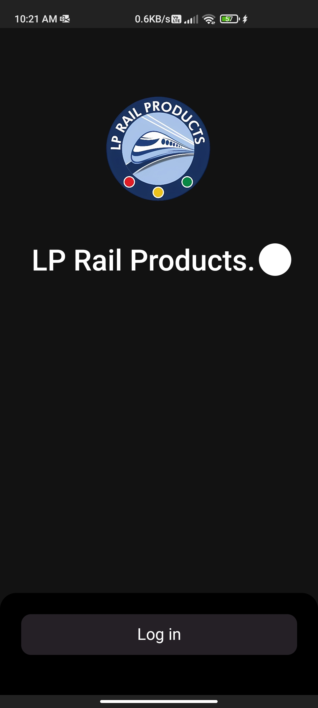
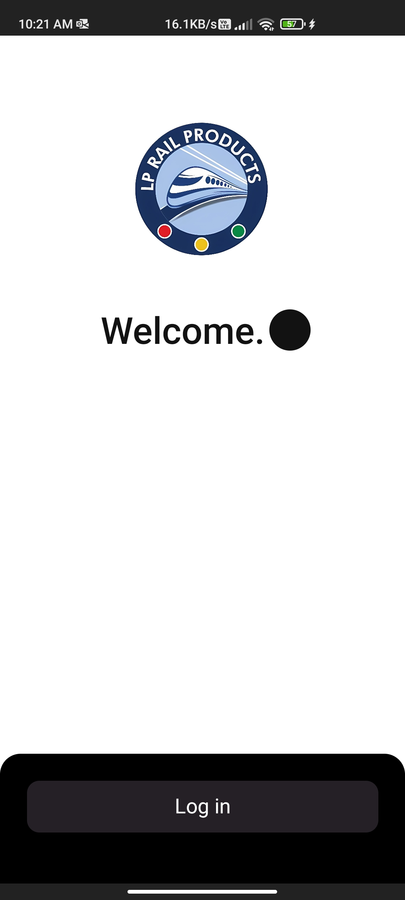
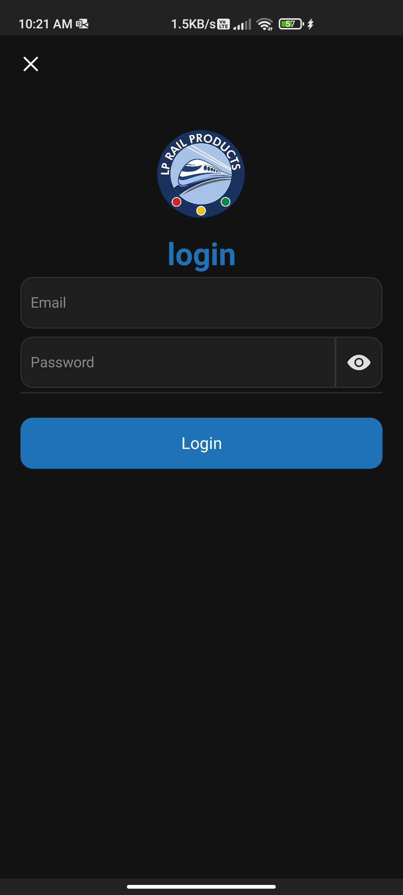
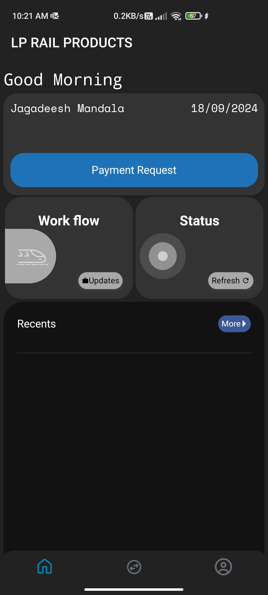
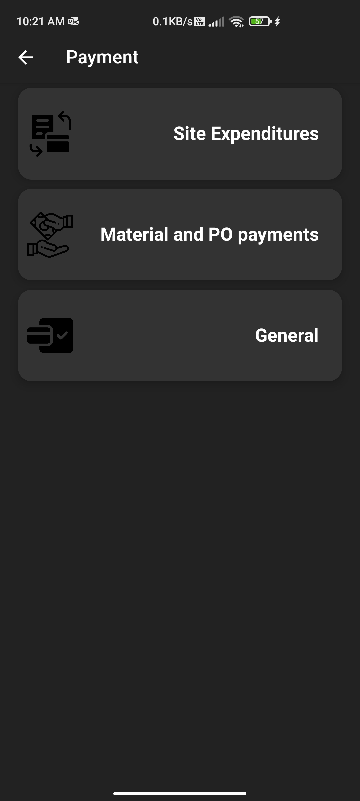
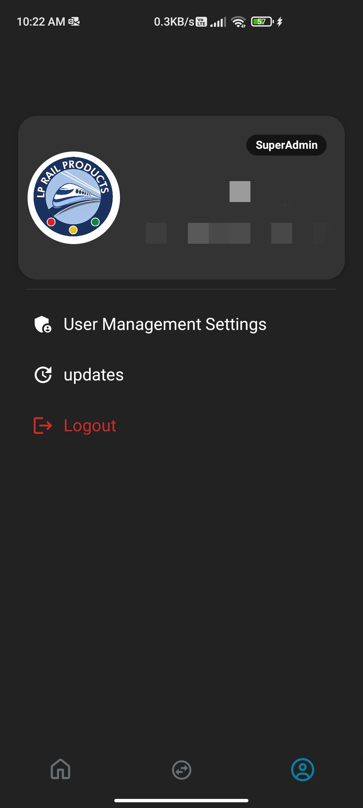
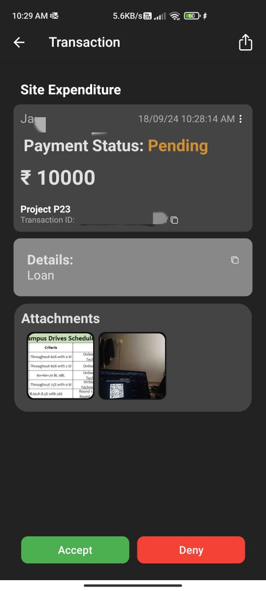
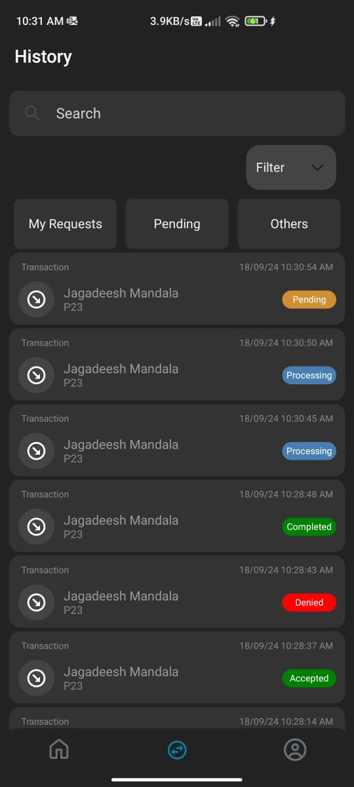

# LP Rail App

## Overview

LP Rail App is an internal tool developed for LP Rail Products, a startup company. The app is designed to streamline and manage the workflow of payments and transactions within the company. It ensures efficient handling of financial operations and maintains a secure record of all transactions.

## Screenshots

Screenshots here to showcase your app.

  
  
  
  
  
  
  
  

## Technologies

The app is built using the following technologies:

- **React Native**: For building the cross-platform mobile application.
- **Expo**: For easy setup and development.
- **Firebase**: Real-time database and user authentication.
- **Cloudinary**: For image storage and management.

## Copyright

© 2024 **LP Rail Products** and Jagadeesh M. All rights reserved.

This application is proprietary software developed by LP Rail Products. Unauthorized copying, distribution, or use of this software is strictly prohibited.

